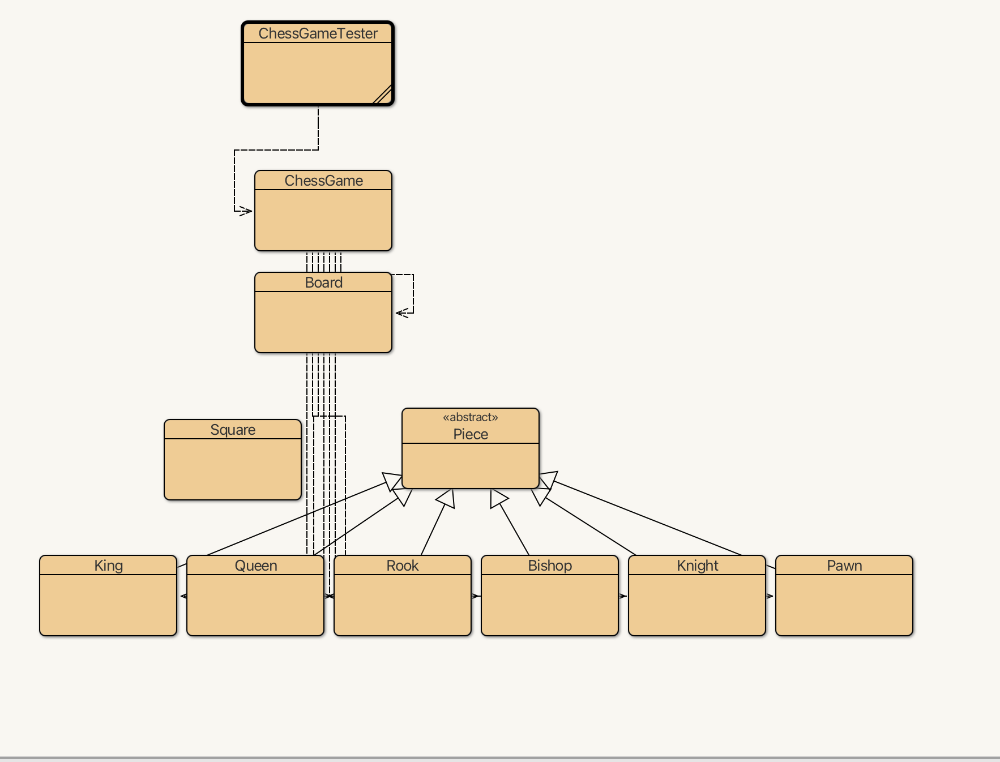

# JavaCheckmate Live by Ajay Anubolu

## Table of Contents
1. [Description](#description)
2. [Usage](#usage)
3. [Documentation](#documentation)
4. [Acknowledgment](#acknowledgment)

## Description
**JavaCheckmate Live** is a live chess board that enables two players to play a game of chess against each other. This project implements a standard 8x8 chessboard, following the standard rule set. Users can enter their moves using chess notation into a move list, and the board will update with each entry.

## Usage
To play a basic chess game, follow these steps:
1. Run the program.
2. Type an opening move, like e4.
3. Switch turns with your friend to input their moves.
4. Continue alternating turns until the game is complete.

Here is a link to the [rules of chess notation](https://www.chess.com/terms/chess-notation) for reference.

# Documentation
Structure will look like this: 

## `ChessBoardGUI` Class

### Class Definition
- The `ChessBoardGUI` class is designed to bridge the game logic encapsulated by the `Board` class with a user-friendly graphical interface. Manages the display of the chessboard and pieces along with the interaction logic, enabling players to select and move pieces.
- 
### Package
- Package: `ajay`

### Imports
- Utilizes **JavaFX libraries** for GUI components, essential for creating and managing the graphical user interface.
- Uses **Java IO and Net** for handling images, enabling the chess pieces to be visually represented with icons.

### Attributes
- `board`: A reference to the `Board` class instance, representing the game's logic and state.
- `imagePath`: String path to the directory containing image assets for the chess pieces.
- `gridPane`: A `GridPane` used to layout the chessboard's squares in a grid format.
- `selectedSquare`: Tracks the currently selected `Square` on the chessboard, if any.
- `selectedPiece`: Holds the currently selected `Piece`, facilitating move operations.

### Constructor
- **`ChessBoardGUI(board: Board)`**
  - Initializes the GUI with references to the game `board`, setting up initial values for `selectedPiece`, `selectedSquare`, and preparing the `gridPane`.
  - Optionally initializes other GUI components like `movesTable` and `movesList`, if tracking of moves is required.

### Methods

#### `createContent()`: `Parent`
- Constructs the primary content of the GUI.
- Initializes an `HBox` or similar container as the root.
- Clears any existing children from the `gridPane`.
- Populates the `gridPane` with buttons representing chessboard squares, dynamically setting their color and attaching event handlers for click actions.
  - Each square/button is assigned a color based on its position to achieve the checkered pattern.
  - If a square contains a piece, its corresponding image is set using `getImageForPiece`.
- Adds the `gridPane` to the root container, along with any other components like a `movesTable`, if utilized.
- Returns the root `Parent` object for display.

#### `getImageForPiece(piece: Piece)`: `Image`
- Determines the correct image URL for a given `Piece`, using its type and the `imagePath`.
- Attempts to load and return the `Image` from the URL, handling any potential IO exceptions.

#### `handleSquareClick(x: int, y: int)`: `void`
- Handles user interaction with the chessboard's squares.
- If no square is currently selected, selects the square and potentially the piece on that square.
- If a square is already selected, attempts to move the selected piece to the new square, according to chess rules.
- Updates the GUI to reflect any changes, such as moving a piece and capturing an opponent's piece.
- Resets `selectedSquare` and `selectedPiece` after the move attempt.

#### `updateGridPane()`: `void`
- Refreshes the `gridPane` to reflect the current state of the `board`.
- Similar to `createContent` but specifically focused on updating the grid's children to match any changes in piece positions or selections.

#### `refreshBoardGUI()`: `void`
- Invokes `updateGridPane`, along with any additional necessary updates to the GUI, ensuring the visual representation is in sync with the game's current state.

### Additional Notes
- 
- This pseudocode aims to provide a foundation for implementing a chess game GUI using JavaFX, with considerations for extensibility and maintainability.

## `Board Class`

### Class Definition: `Board`
- The `Board` class is central to managing the game logic of chess, handling move validation, game state updates, and bot decision-making. Manages the state of the chessboard, including piece positions, turn management, and game state conditions (check, checkmate, stalemate)

### Package
- Package: `ajay`

### Attributes
- `board`: A 2D array of `Square`, representing the chessboard. Each `Square` may contain a `Piece`.
- `whiteCheckmate`: Boolean flag indicating if the white king is in checkmate.
- `blackCheckmate`: Boolean flag indicating if the black king is in checkmate.
- `stalemate`: Boolean flag indicating if the game is in a stalemate, where the current player has no legal move but is not in check.
- `isWhiteTurn`: Boolean indicating if it is White's turn (`true`) or Black's turn (`false`).

### Constructor
- `Board()`
  - Initializes the 8x8 `board` with `Square` objects, representing an empty chessboard.
  - Calls `setupPieces()` to place all chess pieces in their standard starting positions.

### Methods

#### `setupPieces()`
- Places chess pieces for both White and Black players in their standard initial positions on the `board`.

#### `movePiece(startX, startY, endX, endY)`: Boolean
- Attempts to move a piece from `(startX, startY)` to `(endX, endY)`.
- Validates the move based on chess rules, including checking if the path is valid for the specific piece and if the destination is not occupied by a friendly piece.
- Handles special moves like castling and pawn promotion when conditions are met.
- Updates the piece's position on the `board` if the move is valid.
- After the move, checks for checks, checkmates, or stalemate conditions and updates relevant flags.
- Toggles `isWhiteTurn` to switch turns between players.
- Returns `true` if the move was successfully executed, otherwise `false`.

#### `isWhiteCheck()`, `isBlackCheck()`: Boolean
- Determine if the white or black king is in check, respectively. This involves scanning the `board` for potential attacks on the king by opponent pieces.

#### `locateWhiteKing()`, `locateBlackKing()`: int[]
- Finds and returns the coordinates `(x, y)` of the white or black king on the `board`.

#### `getSquare(x, y)`: Square
- Returns the `Square` at the specified coordinates, facilitating access to the piece (if any) located there.

#### AI and Move Evaluation Methods

##### `botMove()`, `botMove2()`
- Simulate AI move decisions. `botMove()` implements a basic greedy algorithm, selecting moves based on piece value and a degree of randomness to avoid predictable behavior.
- `botMove2()` enhances the decision-making process by also considering positional values, mobility (the number of legal moves a piece has), and potential checks/checkmates, aiming for more strategic gameplay.

##### `evaluateMove(piece, move, x, y)`, `evaluateMove2(piece, move, x, y)`: int
- Calculate and return a score representing the value or quality of a given move, considering factors like captured piece value, strategic positioning, and game state implications (e.g., escaping check, putting the opponent in check).
- `evaluateMove2` provides a more complex evaluation, factoring in additional considerations like piece mobility and board control.

##### `getPieceValue(piece)`, `getPieceValue2(piece)`: int
- Return a numeric score representing the value of a piece, with `getPieceValue2` potentially applying different weights or considerations than `getPieceValue`.

##### `getPositionalValue(piece, x, y)`, `getMobilityValue(piece, board, x, y)`: int
- `getPositionalValue` computes a score based on a piece's strategic position on the board.
- `getMobilityValue` calculates a score based on the number of legal moves available for the piece, indicating its mobility.

##### `resultsInCheck(board, x, y, newX, newY, piece)`, `resultsInCheckmate(board, x, y, newX, newY, piece)`: Boolean
- Assess if executing a specific move results in placing the opponent's king in check (`resultsInCheck`) or checkmate (`resultsInCheckmate`).
- These methods simulate the move on a copy of the `board` to evaluate the resulting game state without affecting the actual game.

## `Piece` Enum 

### Enum Definition: `Piece`
Enumerates the different types of chess pieces, centralizing their identification within the game logic. Each enum value represents a unique chess piece, characterized by distinct movement capabilities and roles within the game. This design simplifies the process of implementing game rules and managing piece interactions.

### Package
- Package: `ajay`

### Imports
- Utilize `ArrayList` for dynamic arrays.
- Utilize `Arrays` for array manipulations.

#### Enum Values
Defines specific chess pieces with unique behaviors, particularly for pawns which have custom `getValidMovesIgnoringCheck` implementations:
- `WHITE_KING`, `WHITE_QUEEN`, etc., through `BLACK_PAWN`
  - Each piece is initialized without specific moves (null) and a flag indicating if it is a long-range mover (true for queen, rook, bishop).

### Attributes
- `moves`: 2D array storing the potential moves a piece can make, represented as coordinate changes.
- `isLongRange`: Boolean flag indicating if a piece can move over multiple squares in a single move (e.g., rook, bishop, queen).

### Constructor
- `Piece(moves, isLongRange)`: Initializes the piece with its possible moves and range behavior.

### Methods

#### `copyBoard(board)`: Square[][]
- Creates a deep copy of the chess board, allowing simulation of moves for check detection.

#### `allowsWhiteCheck(board)`: Boolean
- Iterates over the entire board to determine if any black pieces move can capture the white king, indicating a check.

#### `allowsBlackCheck(board)`: Boolean
- Iterates over the entire board to determine if any white pieces move can capture the black king, indicating a check.

#### `getValidMovesWithCheck(board, rank, file, isWhiteTurn)`: int[][]
- Generates valid moves for a piece considering the current state of the board and filtering out moves that would leave or put the player's king in check using 'getvalidMovesIgnoringCheck' and 'copyBoard'.

#### `getValidMovesIgnoringCheck(board, rank, file)`: int[][]
- Calculates valid moves for a piece without considering whether such moves would result in a check using 'getValidMoves'.

##### Overridden Implementation for Pawns (`WHITE_PAWN`, `BLACK_PAWN`)
- `WHITE_PAWN`: Calculates forward movement and captures. Includes special moves like moving two squares forward from the starting position and capturing diagonally.
- `BLACK_PAWN`: Similar logic applied for black pawns but in the opposite direction.

#### `getValidMoves()`: int[][]
- Switch case logic to return an array of valid moves based on the piece type. Each piece type calls its respective method to generate its moves.

#### Detailed Move Generation Methods
- `getWhitePawnMoves`, `getBlackPawnMoves`: Returns moves for pawns, considering their unique forward movement and capture rules.
- `getKnightMoves`: Calculates L-shaped moves.
- `getBishopMoves`: Generates diagonal moves across the board.
- `getRookMoves`: Generates horizontal and vertical moves.
- `getQueenMoves`: Combines the moves of rook and bishop.
- `getKingMoves`: Generates one-square moves in all directions and includes castling under specific conditions.

#### Utility Methods
- `toString()`: Converts the enum name into a formatted string representing the piece's type.
- `isKing()`: Checks if the piece is a king.
- `isWhite()`: Determines if the piece is white based on its enum name.
- `isLongRange()`: Returns true if the piece is capable of long-range movement.

## Acknowledgment
-Thank you to <ins>Ms. Shahin</ins> for teaching me how to code throughout high school!
  
### Libraries
- `java.util` and `JavaFX`
